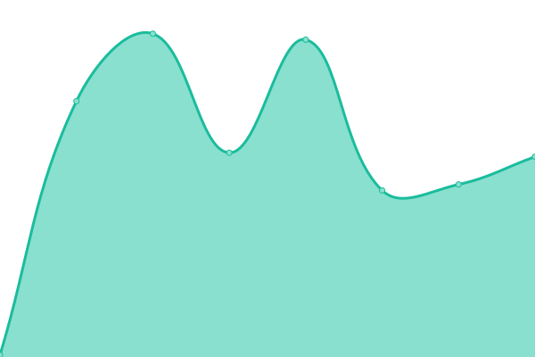

# [📈 Live Status](https://status.yoonik.me): <!--live status--> **🟩 All systems operational**

This repository contains the open-source uptime monitor and status page for [dev-yoonik](www.yoonik.me), powered by [Upptime](https://github.com/upptime/upptime).

With [Upptime](https://upptime.js.org), you can get your own unlimited and free uptime monitor and status page, powered entirely by a GitHub repository. We use [Issues](https://github.com/dev-yoonik/yoonik-systems-status/issues) as incident reports, [Actions](https://github.com/dev-yoonik/yoonik-systems-status/actions) as uptime monitors, and [Pages](https://status.yoonik.me) for the status page.

<!--start: status pages-->
<!-- This summary is generated by Upptime (https://github.com/upptime/upptime) -->
<!-- Do not edit this manually, your changes will be overwritten -->
<!-- prettier-ignore -->
| URL | Status | History | Response Time | Uptime |
| --- | ------ | ------- | ------------- | ------ |
|  [Website](https://www.youverse.id/) | 🟩 Up | [website.yml](https://github.com/dev-yoonik/yoonik-systems-status/commits/HEAD/history/website.yml) | 

 675ms
     
 | 

<a href="https://status.youverse.id/history/website">100.00%</a>
    

|  [YouAuth SSO](https://accounts.youverse.id/health_check) | 🟩 Up | [you-auth-sso.yml](https://github.com/dev-yoonik/yoonik-systems-status/commits/HEAD/history/you-auth-sso.yml) | 

 506ms
     
 | 

<a href="https://status.youverse.id/history/you-auth-sso">100.00%</a>
    

|  [YouAuth API v2](https://enroll.youverse.id/v2.1/yoonik/health) | 🟩 Up | [you-auth-api-v2.yml](https://github.com/dev-yoonik/yoonik-systems-status/commits/HEAD/history/you-auth-api-v2.yml) | 

 475ms
     
 | 

<a href="https://status.youverse.id/history/you-auth-api-v2">100.00%</a>
    

|  [YouAuth API v3](https://enroll.youverse.id/v3/api/health) | 🟩 Up | [you-auth-api-v3.yml](https://github.com/dev-yoonik/yoonik-systems-status/commits/HEAD/history/you-auth-api-v3.yml) | 

 110ms
     
 | 

<a href="https://status.youverse.id/history/you-auth-api-v3">100.00%</a>
    

|  [Face API v2 - Main](https://face.youverse.id/v2/api/health) | 🟩 Up | [face-api-v2-main.yml](https://github.com/dev-yoonik/yoonik-systems-status/commits/HEAD/history/face-api-v2-main.yml) | 

 486ms
     
 | 

<a href="https://status.youverse.id/history/face-api-v2-main">100.00%</a>
    

|  [Face API v2 - Workers](https://face.youverse.id/v2/api/health-worker) | 🟩 Up | [face-api-v2-workers.yml](https://github.com/dev-yoonik/yoonik-systems-status/commits/HEAD/history/face-api-v2-workers.yml) | 

 112ms
     
 | 

<a href="https://status.youverse.id/history/face-api-v2-workers">100.00%</a>
    

<!--end: status pages-->

[**Visit our status website →**](https://status.yoonik.me)

## 📄 License

- Powered by: [Upptime](https://github.com/upptime/upptime)
- Code: [MIT](./LICENSE) © [dev-yoonik](www.yoonik.me)
- Data in the `./history` directory: [Open Database License](https://opendatacommons.org/licenses/odbl/1-0/)
