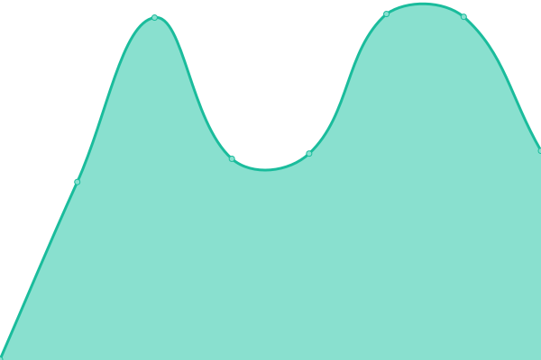
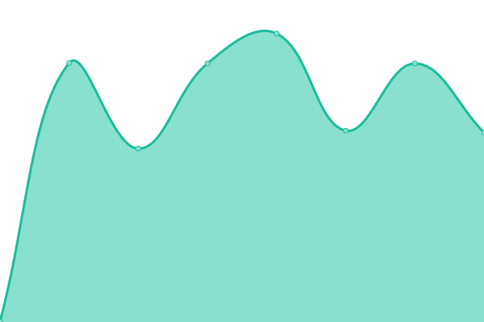
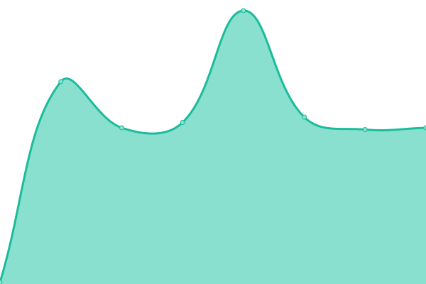

# [📈 Live Status](https://status.yoonik.me): <!--live status--> **🟩 All systems operational**

This repository contains the open-source uptime monitor and status page for [dev-yoonik](www.yoonik.me), powered by [Upptime](https://github.com/upptime/upptime).

With [Upptime](https://upptime.js.org), you can get your own unlimited and free uptime monitor and status page, powered entirely by a GitHub repository. We use [Issues](https://github.com/dev-yoonik/yoonik-systems-status/issues) as incident reports, [Actions](https://github.com/dev-yoonik/yoonik-systems-status/actions) as uptime monitors, and [Pages](https://status.yoonik.me) for the status page.

<!--start: status pages-->
<!-- This summary is generated by Upptime (https://github.com/upptime/upptime) -->
<!-- Do not edit this manually, your changes will be overwritten -->
<!-- prettier-ignore -->
| URL | Status | History | Response Time | Uptime |
| --- | ------ | ------- | ------------- | ------ |
|  [YooniK Website](https://www.yoonik.me/) | 🟩 Up | [yooni-k-website.yml](https://github.com/dev-yoonik/yoonik-systems-status/commits/HEAD/history/yooni-k-website.yml) | 

 813ms
     
 | 

<a href="https://status.yoonik.me/history/yooni-k-website">100.00%</a>
    

|  [YooniK SSO](https://accounts.yoonik.me/health_check) | 🟩 Up | [yooni-k-sso.yml](https://github.com/dev-yoonik/yoonik-systems-status/commits/HEAD/history/yooni-k-sso.yml) | 

 672ms
     
 | 

<a href="https://status.yoonik.me/history/yooni-k-sso">100.00%</a>
    

|  [YooniK Face API v2 - Main](https://face.yoonik.me/v2/api/health) | 🟩 Up | [yooni-k-face-api-v2-main.yml](https://github.com/dev-yoonik/yoonik-systems-status/commits/HEAD/history/yooni-k-face-api-v2-main.yml) | 

 629ms
     
 | 

<a href="https://status.yoonik.me/history/yooni-k-face-api-v2-main">100.00%</a>
    

|  [YooniK Face API v2 - Workers](https://face.yoonik.me/v2/api/health-worker) | 🟩 Up | [yooni-k-face-api-v2-workers.yml](https://github.com/dev-yoonik/yoonik-systems-status/commits/HEAD/history/yooni-k-face-api-v2-workers.yml) | 

 133ms
     
 | 

<a href="https://status.yoonik.me/history/yooni-k-face-api-v2-workers">100.00%</a>
    

|  [YooniK Enroll API v2](https://enroll.yoonik.me/v2.1/yoonik/health) | 🟩 Up | [yooni-k-enroll-api-v2.yml](https://github.com/dev-yoonik/yoonik-systems-status/commits/HEAD/history/yooni-k-enroll-api-v2.yml) | 

 734ms
     
 | 

<a href="https://status.yoonik.me/history/yooni-k-enroll-api-v2">100.00%</a>
    

|  [YooniK Enroll API v3](https://enroll.yoonik.me/v3/api/health) | 🟩 Up | [yooni-k-enroll-api-v3.yml](https://github.com/dev-yoonik/yoonik-systems-status/commits/HEAD/history/yooni-k-enroll-api-v3.yml) | 

 131ms
     
 | 

<a href="https://status.yoonik.me/history/yooni-k-enroll-api-v3">100.00%</a>
    

<!--end: status pages-->

[**Visit our status website →**](https://status.yoonik.me)

## 📄 License

- Powered by: [Upptime](https://github.com/upptime/upptime)
- Code: [MIT](./LICENSE) © [dev-yoonik](www.yoonik.me)
- Data in the `./history` directory: [Open Database License](https://opendatacommons.org/licenses/odbl/1-0/)
