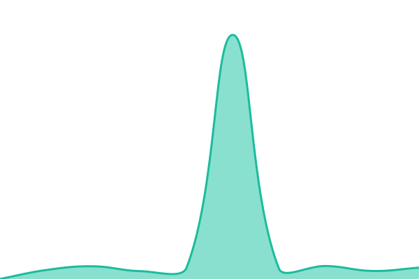

# [📈 Live Status](https://status.youverse.id): <!--live status--> **🟩 All systems operational**

This repository contains the open-source uptime monitor and status page for [dev-yoonik](www.yoonik.me), powered by [Upptime](https://github.com/upptime/upptime).

With [Upptime](https://upptime.js.org), you can get your own unlimited and free uptime monitor and status page, powered entirely by a GitHub repository. We use [Issues](https://github.com/dev-yoonik/yoonik-systems-status/issues) as incident reports, [Actions](https://github.com/dev-yoonik/yoonik-systems-status/actions) as uptime monitors, and [Pages](https://status.yoonik.me) for the status page.

<!--start: status pages-->
<!-- This summary is generated by Upptime (https://github.com/upptime/upptime) -->
<!-- Do not edit this manually, your changes will be overwritten -->
<!-- prettier-ignore -->
| URL | Status | History | Response Time | Uptime |
| --- | ------ | ------- | ------------- | ------ |
|  [Website](https://www.youverse.id/) | 🟩 Up | [website.yml](https://github.com/dev-yoonik/yoonik-systems-status/commits/HEAD/history/website.yml) | 

 546ms
     
 | 

<a href="https://status.youverse.id/history/website">100.00%</a>
    

|  [YouID](https://kyc-web.youverse.id/) | 🟩 Up | [you-id.yml](https://github.com/dev-yoonik/yoonik-systems-status/commits/HEAD/history/you-id.yml) | 

 459ms
     
 | 

<a href="https://status.youverse.id/history/you-id">100.00%</a>
    

|  [YouAuth API](https://enroll.youverse.id/v4/api/health) | 🟩 Up | [you-auth-api.yml](https://github.com/dev-yoonik/yoonik-systems-status/commits/HEAD/history/you-auth-api.yml) | 

 486ms
     
 | 

<a href="https://status.youverse.id/history/you-auth-api">100.00%</a>
    

|  [YouFace API](https://face.youverse.id/v3/api/health) | 🟩 Up | [you-face-api.yml](https://github.com/dev-yoonik/yoonik-systems-status/commits/HEAD/history/you-face-api.yml) | 

 424ms
     
 | 

<a href="https://status.youverse.id/history/you-face-api">100.00%</a>
    

|  [YouLive API](https://face-spoofing.youverse.id/api/health) | 🟩 Up | [you-live-api.yml](https://github.com/dev-yoonik/yoonik-systems-status/commits/HEAD/history/you-live-api.yml) | 

 421ms
     
 | 

<a href="https://status.youverse.id/history/you-live-api">100.00%</a>
    

|  [YouAge API](https://face-analysis.youverse.id/api/health) | 🟩 Up | [you-age-api.yml](https://github.com/dev-yoonik/yoonik-systems-status/commits/HEAD/history/you-age-api.yml) | 

 428ms
     
 | 

<a href="https://status.youverse.id/history/you-age-api">100.00%</a>
    

<!--end: status pages-->

[**Visit our status website →**](https://status.yoonik.me)

## 📄 License

- Powered by: [Upptime](https://github.com/upptime/upptime)
- Code: [MIT](./LICENSE) © [dev-yoonik](www.yoonik.me)
- Data in the `./history` directory: [Open Database License](https://opendatacommons.org/licenses/odbl/1-0/)
